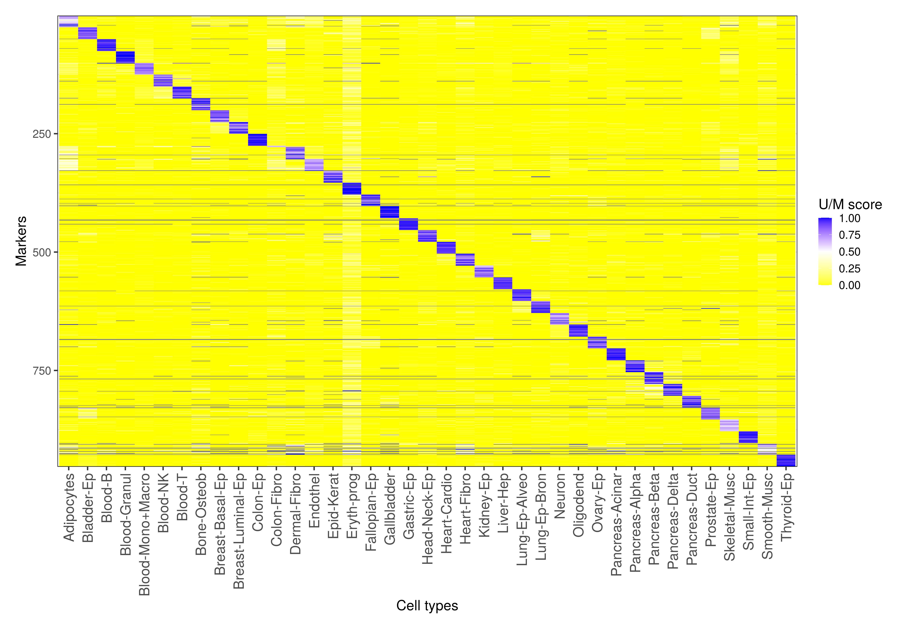

# UXM fragment-level deconvolution algorithm
UXM is a computational fragment-level reference-based deconvolution algorithm for DNA methylation sequencing data.
It generates a reference atlas where the percentages of unmethylated fragments is computed for every marker (row) in each cell type (column).
A non-negative least squares (NNLS) algorithm is then used to fit an input sample, and estimate its relative contributions.

    

    <em>Visualization of the simulated data</em>

<!---->
This project is developed by Netanel Loyfer and Jonathan Rosenski in [Prof. Tommy Kaplan's lab](https://www.cs.huji.ac.il/~tommy/) at the Hebrew University, Jerusalem, Israel.

It converts data from standard formats (e.g., bam, bed) into tailored compact yet useful and intuitive formats ([pat](docs/pat_format.md), [beta](docs/beta_format.md)).
These can be visualized in terminal, or analyzed in different ways - subsample, merge, slice, mix, segment and more.
